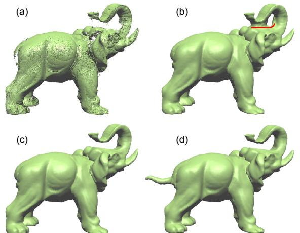

# Data-Parallel Octrees for Surface Reconstruction

Kun Zhou<sup>∗</sup> Minmin Gong† Xin Huang† Baining Guo†

<sup>∗</sup>State Key Lab of CAD&CG, Zhejiang University †Microsoft Research Asia

*Abstract***—We present the first parallel surface reconstruction algorithm that runs entirely on the GPU. Like existing implicit surface reconstruction methods, our algorithm first builds an octree for the given set of oriented points, then computes an implicit function over the space of the octree, and finally extracts an isosurface as a water-tight triangle mesh. A key component of our algorithm is a novel technique for octree construction on the GPU. This technique builds octrees in real-time and uses level-order traversals to exploit the finegrained parallelism of the GPU. Moreover, the technique produces octrees that provide fast access to the neighborhood information of each octree node, which is critical for fast GPU surface reconstruction. With an octree so constructed, our GPU algorithm performs Poisson surface reconstruction, which produces high quality surfaces through a global optimization. Given a set of 500K points, our algorithm runs at the rate of about five frames per second, which is over two orders of magnitude faster than previous CPU algorithms. To demonstrate the potential of our algorithm, we propose a userguided surface reconstruction technique which reduces the topological ambiguity and improves reconstruction results for imperfect scan data. We also show how to use our algorithm to perform on-the-fly conversion from dynamic point clouds to surfaces as well as to reconstruct fluid surfaces for real-time fluid simulation.**

*Index Terms***—surface reconstruction, octree, programable graphics unit, marching cubes**

## **I. Introduction**

Surface reconstruction from point clouds has been an active research area in computer graphics. This reconstruction approach is widely used for fitting 3D scanned data, filling holes on surfaces, and remeshing existing surfaces. So far, surface reconstruction has been regarded as an offline process. Although there exist a number of algorithms capable of producing high-quality surfaces, none of these can achieve interactive performance.

In this paper we present a parallel surface reconstruction algorithm that runs entirely on the GPU. Following previous implicit surface reconstruction methods, our algorithm first builds an octree for the given set of oriented points, then computes an implicit function over the space of the octree, and finally extracts an isosurface as a water-tight triangle mesh using the marching cubes. Unlike previous methods which all run on CPUs, our algorithm performs all computation on the GPU and capitalizes on modern GPUs' massively parallel architecture. Given a set of 500K points, our algorithm runs at the rate of about five frames per second. This is over two orders of magnitude faster than previous CPU algorithms.


**Fig. 1:** *Our GPU reconstruction algorithm can generate high quality surfaces with fine details from noisy real-world scans. The algorithm runs at interactive frame rates. Top left: Bunny, 350K points, 5.2 fps. Top right: Dragon, 1500K points, 1.3 fps. Bottom left: Buddha, 640K points, 4 fps. Bottom right: Armadillo, 500K points, 5 fps.*

The basis of our algorithm is a novel technique for fast octree construction on the GPU. This technique has two important features. First, it builds octrees in real-time by exploiting the fine-grained parallelism on the GPU. Unlike conventional CPU octree builders, which often construct trees by depth-first traversals, our technique is based on level-order traversals: all octree nodes at the same tree level are processed in parallel, one level at a time. Modern GPU architecture contains multiple physical multi-processors and requires tens of thousands of threads to make the best use of these processors [1]. With level-order traversals, our technique maximizes the parallelism by spawning a new thread for every node at the same tree level.

The second feature of our technique is that it constructs octrees that supply the information necessary for GPU surface reconstruction. In particular, it is critical for the octree data structure to provide fast access to tree nodes as well as the neighborhood information of each node (i.e. links to all neighbors of the node), which are required by the implicit function computation and marching cubes algorithms described in Section IV. While information of individual nodes is relatively easy to collect, computing the neighborhood information requires a large number of searches for every single node. Collecting neighborhood information for all nodes of the tree is thus extremely expensive even on the GPU. To address this problem, we make the observation that a node's neighbors are determined by the relative position of the node with respect to its parent and its parent's neighbors. Based on this observation, we build two look up tables (LUT) which record the relative pointers to a node's relatives. Unlike direct pointers, relative pointers are independent of specific instances of octrees and hence can be precomputed. At runtime, the actual pointers are quickly generated by querying the LUTs.

Based on octrees built as above, we develop a GPU algorithm for the Poisson surface reconstruction method [2]. We choose the Poisson method because it can reconstruct high quality surfaces through a global optimization. As part of our GPU algorithm, we derive an efficient procedure for evaluating the divergence vector in the Poisson equation and an adaptive marching cubes procedure for extracting isosurfaces from an implicit function defined over the volume spanned by an octree. Both of these procedures are designed to fully exploit modern GPUs' fine-grained parallel architecture and make heavy use of the octree neighborhood information. Note that GPU algorithms can also be readily designed for classical implicit reconstruction methods (e.g. [3]) by using our octree construction technique and the adaptive marching cubes procedure, as described in the last paragraph of Section IV-D. Therefore, our work provides a general approach for designing GPU algorithms for surface reconstruction.

Our GPU surface reconstruction can be employed immediately in existing applications. As an example, we propose a user-guided reconstruction algorithm for imperfect scan data where many areas of the surface are either under-sampled or completely missing. Similar to a recent technique [4], our algorithm allows the user to draw strokes around poorly-sampled areas to reduce topological ambiguities. Benefiting from the high performance of GPU reconstruction, the user can view the reconstructed mesh immediately after drawing a stroke. In contrast, the algorithm described in [4] requires several minutes to update the reconstructed mesh, although it is able to update the implicit function within less than a second.

GPU surface reconstruction also opens up new possibilities. As an example, we propose an algorithm for generating surfaces for dynamic point clouds on the fly. The reconstructed meshes may be directly rendered by the traditional polygon-based display pipeline. We demonstrate the application of our algorithm in two well-known modeling operations, free-form deformation and boolean operations. With advancements in commodity graphics hardware, realtime surface reconstruction will be realized in the near future. In view of this, our technique may be regarded as a bridging connection between point- and polygon-based representations. We also show our algorithm can be used to reconstruct fluid surfaces for real-time particle-based fluid simulation.

## **II. Related Work**

Surface reconstruction from point clouds has a long history. Here we only cover references most relevant to our work.

Early reconstruction techniques are based on Delaunay triangulations or Voronoi diagrams ([5], [6]) and they build surfaces by connecting the given points. These techniques assume the data is noise-free and densely sampled. For noisy data, postprocessing is often required to generate a smooth surface ([7], [8]). Most other algorithms reconstruct an approximating surface represented in implicit forms, including signed distance functions ([3], [9], [10]), radial basis functions ([11], [12], [13]), moving least square surfaces ([14], [15], [16]), and indicator functions [2]. These algorithms mainly focus on generating high quality meshes to optimally approximate or interpolate the data points.

Existing fast surface reconstruction methods are limited to simple smooth surfaces or height fields. Randrianarivony and Brunnett [17] proposed a parallel algorithm to approximate a point set with NURBS surfaces. Borghese et al. [18] presented a real-time reconstruction algorithm for height fields. For CAD applications, Weinert et al. [19] used a parallel multi-population algorithm to find a CSG representation that best fits data points. None of these techniques is appropriate for reconstructing complex surfaces from point clouds.

Recently, Buchart et al. [20] proposed a GPU interpolating reconstruction method by using local Delaunay triangulation [21]. First, the k-nearest neighbors to each point are computed on the CPU. Then, for each point on the GPU, its neighbors are ordered by angles around the point and the local Delaunay triangulation is computed. For a moderatesized data set (e.g. 250K points), their algorithm needs over 10 seconds, which is still far from interactive performance. In another recent work [22], both the k-nearest neighbors and local Delaunay triangulation are computed on the GPU. However, they need to build an octree on the CPU. Moreover, these Delaunay triangulation based algorithms can only handle noise-free and uniformly-sampled point clouds. For noisy data, they may fail to produce a watertight surface.

With real-world scan data, some areas of the surface may be under-sampled or completely missing. Automatic techniques will fail to faithfully reconstruct the topology of the surface around these areas. Recently Sharf et al. [4] introduced a user-assisted reconstruction algorithm to solve this problem. It asks the user to add local inside/outside constraints at weak regions of unstable topology. An optimal distance field is then computed by minimizing a quadric function combining the data points, user constraints, and a regularization term. This system allows the user to interactively draw scribbles to affect the distance field at a coarse resolution, but the final surface reconstruction at finer resolutions takes several minutes, prohibiting immediate viewing of the reconstructed mesh.

Octree is an important data structure in surface reconstruction algorithms. It is used for representing the implicit function ([13], [2]) and for adaptively extracting iso-surfaces ([23], [24]). Creating an octree for point clouds directly on the GPU, however, is very difficult, mainly because of memory allocation and pointer creation. Lefohn et al. [25] described an abstraction and generic template library for defining complex, random-access graphics processor (GPU) data structures such as octrees. However, Lefohn et al. did not describe a method for constructing octrees on the GPU. Their octrees are constructed on the CPU and then sent to the GPU. Recently, DeCoro and Tatarchuk [26] proposed a real-time mesh simplification algorithm based vertex clustering on the GPU. A probabilistic octree is built on the GPU to support adaptive clustering. This octree, however, does not form a complete partitioning of the volume and only contains node information. Last year, Sun et al. [27] proposed a method to construct an octree for a volume to accelerate photon tracing. Their octree is represented as a dense 3D array of numbers, where the value in each voxel indicates the hierarchy level of the leaf node covering that voxel. In other words, only leaf nodes are generated. Our octrees are significantly more complicated than all these octrees. Specifically, our octrees provide information about vertices, edges and faces of octree nodes, as well as the links to all neighbors of each octree node. This information is necessary for GPU surface reconstruction.

There has been some concurrent work building spatial hierarchies on the GPU, e.g. kd-trees [28] and BVHs (bounding volume hierarchies) [29]. Similar to our algorithm, these methods adopt breadth-first search construction order to maximize GPU's parallelism. The linear BVH construction algorithm in [29] also uses the Morton codes (i.e. the shuffled xyz keys) to build the hierarchy. However, none of them can generate the information about vertices, edges and faces of tree nodes, as well as the neighbors of each tree node.

## **III. GPU Octree Construction**

In this section, we describe how to build an octree O with maximum depth D from a given set of sample points Q = {q<sup>i</sup> | i = 1, ...N}. We first explain the design of the octree data structure. Next we present a procedure for the parallel construction of an octree with only individual nodes. Then we introduce an LUT-based technique for efficiently computing the neighborhood information of every octree node in parallel. Finally, we discuss how to collect information of vertices, edges, and faces of octree nodes.

### **A. Octree Data Structure**

The octree data structure consists of four arrays: vertex array, edge array, face array, and node array. The vertex, edge, and face arrays record the vertices, edges, and faces of the octree nodes respectively. These arrays are relatively simple. In the vertex array, each vertex v records v.nodes, the pointers to all octree nodes that share vertex v. Following v.nodes we can easily reach related elements such as all edges sharing v. In the edge array, each edge records the pointers to its two vertices. Similarly in the face array each face records the pointers to its four edges.

The node array, which records the octree nodes, is more complex. Each node t in the node array NodeArray needs 236 bytes and contains three pieces of information:

- The shuffled xyz key [23], t.key.
- The sample points contained in t.
- Pointers to related data including its parent, children, neighbors, and other information as explained below.

**Shuffled** xyz **Key**: Since each octree node has eight children, it is convenient to number a child node using a 3-bit code ranging from zero to seven. This 3-bit code encodes the subregion covered by each child. We use the xyz convention: if the x bit is 1, the child covers an octant that is "right in x"; otherwise the child covers an octant that is "left in x". The y and z bits are similarly set. The shuffled xyz key of a node at tree depth D is defined as the bit string

$$x\_1 y\_1 z\_1 x\_2 y\_2 z\_2 \cdot \cdot \cdot x\_D y\_D z\_D,$$

indicating the path from the root to this node in the octree. Therefore a shuffled xyz key at depth D has 3D bits. Currently we use 32 bits to represent the key, allowing a maximum tree depth of 10. The unused bits are set to zero.

**Sample Points**: Each octree node records the sample points enclosed by the node. The sample points are stored in a point array and sorted such that all points in the same node are contiguous. Therefore, for each node t, we only need to store the number of points enclosed, t.pnum, and the index of the first point, t.pidx, in the point array.

**Connectivity Pointers**: For each node we record the pointers to the parent node, 8 child nodes, 27 neighboring nodes including itself, 8 vertices, 12 edges, and 6 faces. All pointers are represented as indices to the corresponding arrays. For example, t's parent node is NodeArray[t.parent] and t's first neighboring node is NodeArray[t.neighs[0]]. If the pointed element does not exist, we set the corresponding pointer to −1. Since each node has 27 neighbors at the same depth, the array t.neighs is of size 27.

For consistent ordering of the related elements, we order these elements according to their shuffled xyz keys. For example, t's first child node t.children[0] has the smallest key among t's eight children and the last child t.children[7] has the largest key. The ordering of a node's vertices,


**Fig. 2:** *Element ordering for quadtrees. (a) the ordering of vertices and edges (in blue) in a node; (b) the ordering of a node's children as well as the ordering of nodes sharing a vertex; (c) the ordering of a node's neighboring nodes.*

edges, faces and neighboring nodes are determined by their relative positions in the node. Fig. 2 illustrates the ordering of the related elements for quadtrees; the case with octrees is analogous.

### **B. Building Node Array**

We build the node array using a reverse level-order traversal of the octree, starting from the finest depth D and moving towards the root, one depth at a time.

**At Depth** D: Listing 1 provides the pseudo code for the construction of NodeArrayD, the node array at depth D. This construction consists of six steps. In the first step, the bounding box of the point set Q is computed. This is done by carrying out parallel reduction operations [30] on the coordinates of all sample points. The **Reduce** primitive performs a scan on an input array and outputs the result of a binary associative operator, such as min or max, applied to all elements of the input array.

In the second step, we compute the 32-bit shuffled xyz keys at depth D for all sample points in parallel. Given a point p, its shuffled xyz key is computed in a top-down manner. The x bit at depth d, 1 ≤ d ≤ D, is computed as:

$$x\_d = \begin{cases} 0, & \text{if } p.x < C\_d.x, \\\ 1, & \text{otherwise,} \end{cases}$$

where C<sup>d</sup> is the centroid of the node that contains p at depth d − 1. The y and z bits y<sup>d</sup> and z<sup>d</sup> are similarly computed. All unused bits are set to zero. All sample points are then sorted using their shuffled xyz keys as the sort key. Note that we also pack the index of each sample point and its xyz key to a 64-bit code in order to extract the index of each sample point after sorting.

In the third step, all sample points are sorted using the sort primitive in [31]. This primitive first performs a splitbased radix sort per block and then a parallel merge sort of blocks [32]. After sorting, points having the same key are contiguous in the sorted array. Then the index of each sample point in the original point array is computed by extracting the lower 32 bits of the point's code. The new point array is then constructed by copying the positions and normals from the original point array using the extracted indices.

#### **Listing 1** Build the Node Array at Depth D

- 1: // Step 1: compute bounding box
- 2: Compute Q's the bounding box using **Reduce** primitive
- 3: // Step 2: compute shuffled xyz key and sorting code
- 4: code ← **new** array
- 5: **for each** i = 0 to N − 1 **in parallel**
- 6: Compute key, qi's shuffled xyz key at depth D
- 7: code[i] = key << 32 + i
- 8: // Step 3: sort all sample points
- 9: sortCode ← **new** array
- 10: **Sort**(sortCode, code)
- 11: Generate the new point array according to sortCode
- 12: // Step 4: find the unique nodes
- 13: mark ← **new** array
- 14: uniqueCode ← **new** array
- 15: **for each** element i in sortcode **in parallel**
- 16: **if** sortCode[i].key 6= sortCode[i − 1].key **then**
- 17: mark[i] = **true**
- 18: **else**
- 19: mark[i] = **false**
- 20: **Compact**(uniqueCode, mark, sortCode)
- 21: Create uniqueNode according to uniqueCode
- 22: // Step 5: augment uniqueNode
- 23: nodeNums ← **new** array
- 24: nodeAddress ← **new** array
- 25: **for each** element i in uniqueNode **in parallel**
- 26: **if** element i − 1 and i share the same parent **then** 27: nodeNums[i] = 0
- 28: **else**
- 29: nodeNums[i] = 8
- 30: **Scan**(nodeAddress, nodeNums, +)
- 31: // Step 6: create NodeArray<sup>D</sup>
- 32: Create NodeArray<sup>D</sup>
- 33: **for each** element i in uniqueNode **in parallel**
- 34: t = uniqueNode[i]
- 35: address = nodeAddress[i] + t.xDyDz<sup>D</sup>
- 36: NodeArrayD[address] = t

In the fourth step, a unique node array is generated by removing duplicate keys in the sorted array, as follows. First, for each element of the sorted array, the element is marked as invalid if its key value equals that of its preceding element in the array. Then, the compact primitive from [31] is used to generate the unique node array which does not contain invalid elements. During this process, the relationship between the point array and the node array can be easily built. Specifically, for each element of the node array, we record the number of points contained by this node and the index of the first point in the point array.

In the fifth step, the unique node array obtained in the last step is augmented to ensure that each node's seven siblings are also included, since each octree node has either eight or zero children. In lines 25 ∼ 29 of the pseudo code, each element in the unique node array is checked to see if it shares the same parent with the preceding element. This is done by comparing their keys. If the result is yes, nodeNums[i] is set to zero; otherwise it is set to eight. Then a parallel prefix sum/scan primitive is performed on the array nodeNums, and the result is stored in the array

| Listing 2<br>Compute Neighboring Nodes         | LUTparent[4][9] = {<br>{0, 1, 1, 3, 4, 4, 3, 4, 4},            |
|------------------------------------------------|----------------------------------------------------------------|
| 1: for each node t at depth d<br>in parallel   | {1, 1, 2, 4, 4, 5, 4, 4, 5},<br>{3, 4, 4, 3, 4, 4, 6, 7, 7},   |
| for each j = 0 to 26<br>in parallel<br>2:      | r<br>{4, 4, 5, 4, 4, 5, 7, 7, 8} };                            |
| i ← t's 3-bit xyz key<br>3:                    | b<br>p<br>LUTchild[4][9] = {<br>t<br>s                         |
| p ← NodeArray[t.parent]<br>4:                  | {3, 2, 3, 1, 0, 1, 3, 2, 3},                                   |
| if p.neighs[LUTparent[i][j]] 6= −1 then<br>5:  | {2, 3, 2, 0, 1, 0, 2, 3, 2},                                   |
| h ← NodeArray[p.neighs[LUTparent[i][j]]]<br>6: | {1, 0, 1, 3, 2, 3, 1, 0, 1},<br>{0, 1, 0, 2, 3, 2, 0, 1, 0} }; |
| t.neighs[j] = h.children[LUTchild[i][j]]<br>7: |                                                                |
| else<br>8:                                     | (a) LUTs for quadtrees<br>(b) compute node t's neighbors       |
| t.neighs[j] = −1<br>9:                         |                                                                |
|                                                | Fig. 3:<br>Compute neighboring nodes for quadtrees.            |

nodeAddress. Each element of nodeAddress thus holds the sum of all its preceding elements in nodeNums. In other words, nodeAddress contains the starting address of every unique node in the final node array.

In the final step, the node array NodeArray<sup>D</sup> is created. For each node that is added in the fifth step, only the key value is computed and the number of points contained is set to zero. For each node in uniqueNode, we locate its corresponding element in NodeArray<sup>D</sup> through nodeAddress and its 3-bit xDyDz<sup>D</sup> key, and copy the node's data to this element. For each sample point in the point array, we also save the pointer to the octree node that contains it.

**At Other Depths**: The node array at depth D−1 can be easily built from NodeArrayD. Recall that the eight siblings having the same parent are contiguous in NodeArrayD. For every eight sibling nodes in NodeArrayD, a parent node is generated by setting the last three bits of the keys of these nodes to zero. Again, the resulting parent nodes are augmented as in the fifth step above to generate the final array NodeArrayD−<sup>1</sup>. At this point, each node in NodeArray<sup>D</sup> can get the index of its parent node in NodeArrayD−<sup>1</sup>. For each node t in NodeArrayD−<sup>1</sup>, the pointers to its children are saved. The number of points t.pnum is computed as the sum of that of t's children, and the index of the first point t.pidx is set to be that of t's first child.

The node arrays at other depths can be built the same way. The node arrays of all depths are then concatenated to form a single node array, NodeArray. Another array BaseAddressArray is also created, with each element of the array recording the index of the first node at each depth in NodeArray.

### **C. Computing Neighborhood Information**

For each octree node in NodeArray, we wish to find its neighboring octree nodes at the same depth. This neighborhood information is not only critical for computing the implicit function and running the marching cubes procedure as described in Section IV, but also important for building the vertex, edge, and face arrays.

Each node has up to 26 neighbors at the same depth, distributed among its sibling nodes and the child nodes of its parent's neighbors. A naive approach for computing the neighbors is to enumerate all these candidate nodes, which requires 26 × 27 × 8 = 5616 searches for each node (26 neighbors, its parent and 26 neighbors of its parent, each neighbor having 8 children). Our observation is that a node's neighbors are determined by the relative position of the node with respect to its parent and its parent's neighbors. Based on this observation we precompute two look up tables to significantly speed up this neighborhood computation. These two LUTs are defined as follows:

- **Parent Table**: the parent table LUT parent is a 2D array providing the following information: For an octree node t whose parent is p, if t's index (or xyz key) in p.children is i, then the index of t.neighs[j]'s parent in p.neighs is LUT parent[i][j].
- **Child Table**: the child table LUT child is a 2D array with the following information: For the node t with parent p and index i in p.children as above, if node t's j-th neighbor t.neighs[j], whose parent node is h, the index of t.neigh[j] in h.children is LUT child[i][j].

The size of both tables is 8×27. For convenience we regard a node as a neighbor of itself with index 13 in neighs.

Note that we distinguish two kinds of pointers. The *direct* pointers are those represented as indices into one of the "global" arrays: the node, vertex, edge, and face arrays. For example, t.parent is a direct pointer. The *relative* pointers are those represented as indices into one of the "local" arrays of a node: t.neighs, t.children, t.vertices, t.edges, and t.f aces. The above two tables both record only relative pointers, which are independent of specific instances of octrees and hence can be precomputed.

Listing 2 provides the pseudo code for computing the neighboring nodes for each node t at depth d in parallel. First, we fetch t's parent p and its xyz key, which is t's index in p.children. To compute t's j-th neighbor t.neighs[j], we get this neighbor's parent node h by querying LUT parent and then get the neighbor using a second query to LUT child. Compared with the naive enumeration approach, our technique only needs 27 searches and is over two orders of magnitude faster.

For clarity we use quadtrees to illustrate Listing 2. The two tables for quadtrees, LUT parent and LUT child, are of size 4×9 as shown in Fig. 3(a). As shown in Fig. 3(b), the quadtree node t's parent is p, and t's index in p.children is 0 (i.e. i = 0). To compute t's 2-th neighbor (i.e. j = 2), we first get p's 1-th neighbor, which is b, according to LUT parent[0][2] ≡ 1. Since LUT child[0][2] ≡ 3, b's 3-th child, which is r, is the neighboring node we want. Therefore, t.neighs[2] = b.children[3] = r.

To compute t's 7-th neighbor (i.e. j = 7), we first get p's 4-th neighbor, which is p itself, according to LUT parent[0][7] ≡ 4. Since LUT child[0][7] ≡ 1, p's 1-th child, which is s, is the node we want. Therefore, t.neighs[7] = p.children[1] = s.

When computing a node's neighbors, its parent's neighbors are required. For this reason we perform Listing 2 for all depths using a (forward) level-order traversal of the octree. If node t's j-th neighbor does not exist, t.neighs[j] is set as −1. For the root node, all its neighbors is −1 except its 13-th neighbor which is the root itself.

### **D. Vertex, Edge, and Face Arrays**

**Vertex Array**: Each octree node has eight corner vertices. Simply adding the eight vertices of every node into the vertex array will introduce many duplications because a corner may be shared by up to eight nodes. A simple way to create a duplication-free vertex array is to sort all the candidate vertices by their keys and then remove duplicate keys, just as we did for the node array in Section III-B. This approach, however, is inefficient due to the large number of nodes. For example, for the Armadillo example shown in Fig. 1, there are around 670K nodes at depth 8 and the number of candidate vertices is over 5M. Sorting such a large array takes over 100ms.

We present a more efficient way to create the vertex array by making use of node neighbors computed in Section III-C. Building the vertex array at octree depth d takes the following steps. First, we find in parallel a unique *owner node* for every corner vertex. The owner node of a corner is defined as the node that has the smallest shuffled xyz key among all nodes sharing the corner. Observing that all nodes that share corners with node t must be t's neighbors, we can quickly locate the owner of each corner from t's neighbors. Second, for each node t in parallel, all corner vertices whose owner is t itself are collected. The unique vertex array is then created. During this process, the vertex pointers t.vertices are saved. For each vertex v in the vertex array, the node pointers v.nodes are also appropriately set.

To build the vertex array of all octree nodes, the above process is performed at each depth independently, and the resulting vertex arrays are concatenated to form a single vertex array. Unlike the node array, the vertex array so obtained still has duplicate vertices between different depths. However, since this does not affect our subsequent surface reconstruction, we leave these duplicate vertices as they are in our current implementation.

**Other Arrays**: The edge and face arrays can be built in a similar way. For each edge/face of each node, we first find its owner node. Then the unique edge/face array is created by collecting edges/faces from the owner nodes.

## **IV. GPU Surface Reconstruction**

In this section we describe how to reconstruct surfaces from sample points using the octree constructed in the last section. The reconstruction roughly consists of two steps. First, an implicit function ϕ over the volume spanned by the octree nodes is computed using Poisson surface reconstruction [2]. Then, an adaptive marching cubes procedure extracts a watertight mesh as an isosurface of the implicit function.

Note that, instead of Poisson surface reconstruction, we may use other methods (e.g. [3] and [13]) for GPU surface reconstruction. We chose the Poisson approach because it can reconstruct high quality surfaces through a global optimization. In addition, the Poisson approach only requires solving a well-conditioned sparse linear system, which can be efficiently done on the GPU.

Specifically, we perform the following steps on the GPU:

- 1) Build a linear system Lx = b, where L is the Laplacian matrix and b is the divergence vector;
- 2) Solve the above linear system using a multigrid solver,
- 3) Compute the isovalue as an average of the implicit function values at sample points,
- 4) Extract the isosurface using marching cubes.

The mathematical details of Poisson surface reconstruction (Step 1 and 2) are reviewed in Appendix. In the following, we describe the GPU procedures for these steps.

# **A. Computing Laplacian Matrix** L

As described in Appendix, the implicit function ϕ is a weighted linear combination of a set of blending functions {Fo} with each function F<sup>o</sup> corresponding to a node of the octree. An entry of the Laplacian matrix Lo,o′ = hFo, ∆F<sup>o</sup> ′ i is the inner product of blending function F<sup>o</sup> and the Laplacian of F<sup>o</sup> ′ .

The blending function F<sup>o</sup> is given by a fixed basis function F:

$$F\_o(q) = F\left(\frac{q - o.c}{o.w}\right) \frac{1}{o.w^3},\tag{1}$$

where o.c and o.w are the center and width of the octree node o. F is non-zero only inside the cube [−1, 1]<sup>3</sup> . As explained in Appendix, F is a separable function of x, y and z. As a result, the blending function F<sup>o</sup> is separable as well and can be expressed as:

$$F\_o(x, y, z) = f\_{o.x, o.w}(x) f\_{o.y, o.w}(y) f\_{o.z, o.w}(z).$$

Given the definition of Laplacian ∆F<sup>o</sup> ′ = ∂ <sup>2</sup>Fo′ ∂x<sup>2</sup> + ∂ <sup>2</sup>Fo′ ∂y<sup>2</sup> + ∂ <sup>2</sup>Fo′ ∂z<sup>2</sup> , the Laplacian matrix entry <sup>L</sup>o,o′ can be computed

#### **Listing 3** Compute Divergence Vector b

1: // Step 1: compute vector field 2: **for each** node o at depth D **in parallel** 3: ~v<sup>o</sup> = 0 4: **for** j = 0 to 26 5: t ← NodeArray[o.neighs[j]] 6: **for** k = 0 to t.pnum 7: i = t.pidx + k 8: ~v<sup>o</sup> + = ~niF<sup>q</sup>i,o.w(o.c) 9: // Step 2: compute divergence for finer depth nodes 10: **for** d = D to 5 11: **for each** node o at depth d **in parallel** 12: b<sup>o</sup> = 0 13: **for** j = 0 to 26 14: t ← NodeArray[o.neighs[j]] 15: **for** k = 0 to t.dnum 16: idx = t.didx + k 17: o ′ ← NodeArray[idx] 18: b<sup>o</sup> + = ~vo′~uo,o′ 19: // Step 3: compute divergence for coarser depth nodes 20: **for** d = 4 to 0 21: divg ← **new array** 22: **for** node o at depth d 23: **for each** depth-D node o ′ covered by all nodes in o.neighs **in parallel** 24: divg[i] = ~vo′~uo,o′

as:

25: b<sup>o</sup> = **Reduce**(divg, +)

$$\begin{split} \mathbf{L}\_{o,o'} &= \left< F\_o, \frac{\partial^2 F\_{o'}}{\partial x^2} \right> + \left< F\_o, \frac{\partial^2 F\_{o'}}{\partial y^2} \right> + \left< F\_o, \frac{\partial^2 F\_{o'}}{\partial z^2} \right> = \\ & \left< f\_{o.x,o.w}, f\_{o'.x,o'.w}^{\prime\prime} \right> \langle f\_{o.y,o.w}, f\_{o'.y,o'.w} \rangle \langle f\_{o.z,o.w}, f\_{o'.z,o'.w} \rangle + \\ & \langle f\_{o.x,o.w}, f\_{o'.x,o'.w} \rangle \langle f\_{o.y,o.w}, f\_{o'.y,o'.w}^{\prime\prime} \rangle \langle f\_{o.z,o.w}, f\_{o'.z,o'.w} \rangle + \\ & \langle f\_{o.x,o.w}, f\_{o'.x,o'.w} \rangle \langle f\_{o.y,o.w}, f\_{o'.y,o'.w} \rangle \langle f\_{o.z,o.w}, f\_{o'.z,o'.w}^{\prime\prime} \rangle \langle f\_{o.z,o.w}, f\_{o'.z,o'.w}^{\prime\prime} \rangle. \end{split}$$

All the above inner products can be efficiently computed by looking up two precomputed 2D tables: one for hfo, f<sup>o</sup> ′ i and the other for hfo, f′′ o ′ i. These two tables are queried using the x-bits, y-bits, or z-bits of the shuffled xyz keys of node o and o ′ . This reduces the table size significantly. For a maximal octree depth 9, the table size is (2<sup>10</sup>−1)×(2<sup>10</sup>−1). The table size may be further reduced because the entries of the tables are symmetric.

# **B. Evaluating Divergence Vector** b

As described in Appendix, the divergence coefficients b<sup>o</sup> can be computed as:

$$b\_o = \sum\_{o' \in \mathcal{O}^D} \vec{v}\_{o'} \cdot \vec{u}\_{o,o'},$$

where ~uo,o′ = hFo(q), ∇F<sup>o</sup> ′ i. O<sup>D</sup> is the set of all octree nodes at depth D. The inner product hFo(q), ∇F<sup>o</sup> ′ i can be quickly computed using a precomputed look up table for hfo, f′ o ′ i as in the computation of Lo,o′ . As for ~v<sup>o</sup> ′ , it is computed as

$$
\vec{v}\_{o'} = \sum\_{q\_i \in Q} \alpha\_{o', q\_i} \vec{n}\_i,\tag{2}
$$

where αo,q<sup>i</sup> is the weight by which each sampling point q<sup>i</sup> distributes the normal ~n<sup>i</sup> to its eight closest octree nodes at depth D.

**Listing 4** Compute Implicit Function Value ϕ<sup>q</sup> for Point q 1: ϕ<sup>q</sup> = 0 2: nodestack ← **new stack** 3: nodestack.push(proot) 4: **while** nodestack is not empty 5: o ← NodeArray[nodestack.pop()] 6: ϕq+ = Fo(q)ϕ<sup>o</sup> 7: **for** i = 0 to 7 8: t ← NodeArray[o.children[i]] 9: **if** q.x − t.x < t.w and q.y − t.y < t.w and q.z − t.z < t.w **then** 10: nodestack.push(o.children[i])

Listing 3 provides the pseudo code for computing the divergence vector b. This computation takes three steps. In the first step, the vector field ~v<sup>o</sup> ′ is computed for each octree node o ′ according to Eq. (2). Since Eq. (2) essentially distributes sample point qi's normal ~n<sup>i</sup> to its eight nearest octree nodes at depth D, vector ~v<sup>o</sup> ′ is only affected by the sample points that are contained in either node o ′ or its 26 neighbors. The pointers to the node neighbors as recorded in Section III-C are used to locate these neighbors.

In the second step, the divergence at every finer depth, which is defined as any depth greater than four, is computed in parallel for all nodes, as shown in Step 2 of Listing 3. The most obvious way to accumulate b<sup>o</sup> for each octree node o is to iterate through all nodes o ′ at depth D. However, this costly full iteration is actually not necessary. Since the basis function F's domain of support is the cube [−1, 1]<sup>3</sup> , ~uo,o′ equals zero for a large number node pairs (o, o′ ). Specifically, we can easily prove that, for node o, only the depth-D nodes whose ancestors are either o or o's neighbors have nonzero ~uo,o′ . These nodes can be located by iterating over o's neighbors. Note that t.dnum and t.didx are the number of depth-D nodes covered by t and the pointer to t's first depth-D node respectively. These information can be easily obtained and recorded during tree construction.

In the third step, the divergence at every coarser depth, which is defined as any depth no greater than four, is computed. For nodes at a coarser depth, the approach taken in the second step is not appropriate because it cannot exploit the fine-grained parallelism of GPUs. The node number at coarser depths is much smaller than that at finer depths, and the divergence of a node at a coarser depth may be affected by many depth-D nodes. For example, at depth zero, there is only one root node and all depth-D nodes contribute to its divergence. To maximize parallelism, we parallelize the computation over all covered depth-D nodes for nodes at coarser depths. As shown in Step 3 of Listing 3, we first compute the divergence contribution for each depth-D node in parallel and then perform a reduction operation to sum up all contributions.

### **C. Multigrid Solver and Implicit Function**

The GPU multigrid solver is rather straightforward. For each depth d from coarse to fine, the linear system L <sup>d</sup>x <sup>d</sup> = b d is solved using a conjugate gradient solver for sparse matrices [33]. L d contains as many as 27 nonzero entries in a row. For each row, the values and column indices of nonzero entries are stored in a fixed-sized array. The number of the nonzero entries is also recorded.

Note that the divergence coefficients at depth d need to be updated using solutions at coarser depths according to Eq. (6) in Appendix. For the blending function F<sup>o</sup> of an arbitrary octree node o, it can be easily shown that only the blending functions of o's ancestors and their 26 neighbors may overlap with Fo. Therefore, we only need to visit these nodes through the pointers stored in parent and neighs fields of node o.

To evaluate the implicit function value at an arbitrary point q in the volume, we need to traverse the octree. Listing 4 shows the pseudo code of a depth-first traversal for this purpose. A stack is used to store the pointers to all nodes to be traversed. For this traversal, a stack size of 8D is enough for octrees with a maximal depth D.

Note that the implicit function value of a sample point q<sup>i</sup> can be evaluated in a more efficient way, because we already know the depth-D node o where q<sup>i</sup> is located. In other words, we only need to traverse octree nodes whose blending function may overlap with that of o. These nodes include o itself, o's neighbors, o's ancestors, and the neighbors of o's ancestors. Once we get the implicit function values at all sample points, the isovalue is computed as an average: ϕ¯ = P <sup>i</sup> ϕ(qi)/N. A point is deemed to be outside the surface being reconstructed if its implicit function value is greater than ϕ¯.

### **D. Isosurface Extraction**

We use the marching cubes technique [34] on the leaf nodes of the octree to extract the isosurface. The output is a vertex array and a triangle array which can be rendered directly.

As shown in Listing 5, the depth-D nodes are processed in five steps. First, the implicit function values are computed for all octree vertices in parallel. As in the case with the sample points, each vertex v's implicit function value can be efficiently computed by traversing only the related nodes, which can be located through the pointers stored in v.nodes. Second, the number of output vertices is computed with a single pass over the octree edges and the output address is computed by performing a scan operation. Third, each node's cube category is calculated and the number and addresses of output triangles are computed. Finally, in Step 4 and 5 the vertices and triangles are generated and saved. During this process, for each face of each node, if one of its four edges has a surface-edge intersection, the face is deemed to contain surface-edge intersections and we mark the face. This information is propagated to the node's ancestors.

For all leaf nodes at other depths, we first filter out nodes that do not produce triangles in parallel. For each node, if

#### **Listing 5** Marching Cubes

- 1: // Step 1: compute implicit function values for octree vertices
- 2: vvalue ← **new array**
- 3: **for each** octree vertex i at depth-D **in parallel**
- 4: Compute the implicit function value vvalue[i]
- 5: vvalue[i] − = ¯ϕ
- 6: // Step 2: compute vertex number and address
- 7: vexNums ← **new array**
- 8: vexAddress ← **new array**
- 9: **for each** edge i at depth-D **in parallel**
- 10: **if** the values of i's two vertices have different sign **then**
- 11: vexNums[i] = 1
- 12: **else**
- 13: vexNums[i] = 0
- 14: **Scan**(vexAddress, vexNums, +)
- 15: // Step 3: compute triangle number and address
- 16: triNums ← **new array**
- 17: triAddress ← **new array**
- 18: **for each** node i at depth-D **in parallel**
- 19: Compute the cube category based the values of i's vertices
- 20: Compute triNums[i] according to the cube category
- 21: **Scan**(triAddress, triNums, +)
- 22: // Step 4: generate vertices
- 23: Create V ertexBuffer according to vexAddress
- 24: **for each** edge i at depth-D **in parallel**
- 25: **if** vexNums[i] == 1 **then**
- 26: Compute the surface-edge intersection point q

```
27: V ertexBuffer[vexAddress[i]] = q
```
- 28: // Step 5: generate triangles
- 29: Create TriangleBuffer according to triAddress
- 30: **for each** node i at depth-D **in parallel**
- 31: Generate triangles based on the cube category
- 32: Save triangles to TriangleBuffer[triAddress[i]]

the implicit function values at its eight corners have the same sign and none of its six faces contain surface-edge intersections, the node does not need any further processing. Otherwise, we subdivide the node to depth D. All the depth-D nodes generated by this subdivision are collected to build the new node, vertex and edge arrays. Then, we perform Listing 5 to generate vertices and triangles. This procedure is carried out iteratively until no new triangles are produced. Note that in each iteration, we do not need to handle the nodes subdivided in previous iterations.

Finally, to remove duplicate surface vertices and merge vertices located closely to each other, we compute the shuffled xyz key for each vertex and use the keys to sort all vertices. Vertices having the same key values are merged by performing a parallel compact operation. The elements in the triangle array are updated accordingly and all degenerated triangles are removed. Each triangle's normal is also computed.

**Discussion**: Besides the Poisson method, we can also design GPU algorithms for other implicit reconstruction methods. For example, an early technique [3] calculates a signed distance field and reconstructs a surface by extracting the zero set of the distance field using the marching cubes. With the octrees we construct, the distance field can

| Model     | # Points | Tree Depth | # Triangles | Memot | Mem   | Tot   | Tfunc | Tiso | Ttotal | FPS  | T<br>ot<br>cpu | Tcpu |
|-----------|----------|------------|-------------|-------|-------|-------|-------|------|--------|------|----------------|------|
| Bunny     | 353272   | 8          | 228653      | 120MB | 290MB | 40ms  | 144ms | 6ms  | 190ms  | 5.26 | 8.5s           | 39s  |
| Buddha    | 640735   | 8          | 242799      | 160MB | 320MB | 50ms  | 167ms | 35ms | 252ms  | 3.97 | 16.1s          | 38s  |
| Armadillo | 512802   | 8          | 201340      | 140MB | 288MB | 43ms  | 149ms | 5ms  | 197ms  | 5.06 | 12.8s          | 42s  |
| Elephant  | 216643   | 8          | 142197      | 200MB | 391MB | 46ms  | 209ms | 41ms | 296ms  | 3.38 | 5.5s           | 34s  |
| Hand      | 259560   | 8          | 184747      | 125MB | 253MB | 36ms  | 143ms | 27ms | 206ms  | 4.85 | 6.4s           | 26s  |
| Dragon    | 1565886  | 9          | 383985      | 230MB | 460MB | 251ms | 486ms | 23ms | 760ms  | 1.31 | 39.1s          | 103s |

**TABLE I:** *Running time and memory performance for some examples shown in the paper. # Triangles is the number of triangles in the reconstructed surface. Mem*ot *is the memory consumed by the octree data structure only, and Mem is the total memory consumed by the whole algorithm.* Tot*,* Tfunc*,* Tiso *and* Ttotal *are the time for building octree, implicit function computation (including both linear system building and solving), isosurface extraction and total time respectively, using our GPU algorithm. FPS is the frame rates of our algorithm. For comparison,* T ot cpu *and* Tcpu *are the octree building time and total time using the CPU algorithm [2].*

be quickly estimated on the GPU: processing each octree vertex in parallel, we locate its nearest sample point by traversing the octree using a procedure similar to that shown in Listing 4 and compute the signed distance between the vertex and a plane defined by the position and normal of this sample point. Then our adaptive marching cubes procedure is applied to extract the zero set surface. As noted in [2], the quality of surfaces reconstructed this way is not as good as those produced by the Poisson method.

## **V. Results and Applications**

We have implemented the described surface reconstruction algorithm on an Intel Xeon 3.7GHz CPU with a GeForce 8800 ULTRA (768MB) graphics card.

**Implementation Details**: The G80 GPU is a highly parallel processor working on many threads simultaneously. CUDA structures GPU programs into parallel thread blocks of up to 512 parallel threads. We need to specify the number of thread blocks and threads per block for GPU programs, i.e. the parallel primitives (e.g. **Sort**, **Compact** and **Scan**) and the programs marked **in parallel**. In our current implementation, we use 256 threads for each block. The block number is computed by dividing the total number of parallel processes by the thread number per block. For example, in Step 2 (line 5) of Listing 1, the block number is N/256.

The whole octree data and multigrid solver data are stored in the global memory/texture memory. They are too huge to be stored in the shared memory, which is mainly used in GPU primitives such as sort, compact and scan. For these primitives, we used the implementation provided in CUDPP [31], which is well optimized in terms of coalescent memory access. Since most computations in our algorithm map to these primitives, our algorithm is well optimized. The LUTs are also stored in the shared memory.

**Reconstruction Results**: We tested our algorithm on a variety of real-world scan data. As a preprocess, normals are computed using Stanford's Scanalyze system. As shown in Fig. 1, our GPU algorithm is capable of generating high quality surfaces with fine details from noisy real-world scans, just like the CPU algorithm in [2].

In terms of performance, the GPU algorithm is over two orders of magnitude faster than the CPU algorithm. For example, for the Stanford Bunny, the GPU algorithm runs at 5.2 frames per second, whereas the CPU algorithm takes 39 seconds for a single frame. Note that the CPU implementation is provided by the authors of [2] and is well optimized.

As summarized in TABLE I, the GPU algorithm achieves interactive performance for all examples shown in the paper. Currently, the implicit function computation, especially the stage of building the linear system, is the bottleneck of our algorithm. The time for octree construction occupies a relatively small fraction. Compared with the CPU octree construction algorithm, our GPU octree builder is also over two orders of magnitude faster.

Note that the Dragon model in TABLE I contains some noisy points that distribute far away from the dragon body. So its bounding box is not fit tightly to the dragon body. This leads to the result that the number of output triangles at level 9 is about 460K, comparable to those numbers reported in [2].

**Limitation**: The memory consumption of our algorithm is dominated by the octree depth as is the case with CPU reconstruction algorithms. As a result, our GPU reconstruction can only handle octrees with a maximal depth of 9 due to the limited memory of our current graphics card. On the other hand, since the memory consumption is not dominated by the input point cloud size, our algorithm can handle large input point clouds. For example, the algorithm can handle only 2000K points at octree depth 9. But at octree depth 8, the algorithm can handle up to 5000K points (consumes around 600MB memory, runs at around 2 frames per second). Our ability to handle large input also increases with the rapid improvements in graphics hardware (e.g. Quadro FX 5600 released by NVIDIA supports CUDA and has 1.5GB memory). Nevertheless, with the advent of 3D scanners, scanned models are likely to contain too many points to be handled by any GPU and CPU method. There is a need to develop out-of-core methods on GPUs as well as on CPUs. This is beyond the scope of this paper and left to future work.



**Fig. 4:** *User-guided reconstruction of a scanned elephant model. (a) The input scan. (b) The result from automatic reconstruction. The head and trunk are mistakenly connected. (c) The improved surface after the user draws the stroke shown in (b). (d) A tail copied from the Armadillo is added around the rear end of the elephant. A new elephant surface with the new tail is immediately reconstructed. See the companion video for live demos.*

### **A. User-Guided Surface Reconstruction**

Using our GPU reconstruction technique, we develop a user-guided surface reconstruction algorithm for imperfect scan data. The algorithm allows the user to draw strokes to reduce topological ambiguities in areas that are undersampled or completely missing in the input data. Since our GPU reconstruction technique is interactive, the user can view the reconstructed surface immediately after drawing a stroke. Compared with a previous user-assisted method [4] which takes several minutes to update the reconstructed mesh, our approach is more effective and provides better user experience.

Our basic idea is to first add new oriented sample points to the original point cloud based on user interaction. Then a new isosurface is generated for the augmented point cloud. Suppose Q is the original point set and Q′ is the current point set after each user interaction. After the user draws a stroke, our system takes the following steps to generate the new surface:

- 1) Compute the depth range of Q's bounding box under the current view.
- 2) Iteratively extrude the stroke along the current view direction in the depth range, with a user-specified interval w. For each extruded stroke, a set of points are uniformly distributed along the stroke, also with interval w. Denote this point set as S.
- 3) For points in S, compute their implicit function values in parallel using the procedure in Listing 4.
- 4) Remove points from S whose implicit function values are not less than the current isovalue ϕ¯.
- 5) Compute normals for all points in S.


**Fig. 5:** *User-guided reconstruction of a scanned hand model. Left: the automatic reconstruction result. Several fingers are mistakenly connected. Right: the improved surface after the user draws two rectangles.*

- 6) Add S to the current point set Q′ .
- 7) Perform GPU reconstruction with Q′ as input and generate the new isosurface.

In Step 2, the interval w is set to be the width of an octree node at depth D by default. Step 4 removes points outside of the current reconstructed surface because we only wish to add new points in inner regions, where topological ambiguity is found. This scheme works well for all tested data shown in this paper. Note that unwanted points may be accidentally introduced in some inner regions. When this happens, the user can remove those points manually. In Step 7, the new isovalue is always computed as the average of the implicit function values of points in the original point set Q because we want to restrict the influence of newlyadded points to local areas. The new points are only used to change the local vector field.

Our current system provides two ways to compute the normals for points in S in Step 5. One is based on normal interpolation. For each point s<sup>i</sup> ∈ S, we traverse the octree of Q′ and find all points of Q′ which are enclosed by a box centered at s<sup>i</sup> . Then si's normal is computed as an interpolation of the normals of these points. The interpolation weight of a point q ′ is proportional to the reciprocal of the squared distance between q ′ and s<sup>i</sup> . The box size is a user-specified parameter. If no point is found given the current box size, the algorithm automatically increases the box size and traverses the octree again. The other scheme for computing the normals is relatively simple. The normals are restricted to be orthogonal to both the current viewing direction and the tangents of the stroke. We always let the normals point to the right side of the stroke.

Note that for the first normal computation scheme, the user's interaction is not limited to drawing strokes. We also allow users to draw a rectangle or any closed shape to define an area where they want to insert new points. This shape is then extruded along the current view direction in the depth range to form a volume and a set of points is uniformly distributed inside the volume. After that, Steps 3 ∼ 7 are performed to generate a new isosurface.


**Fig. 6:** *Free form deformation and boolean operations. Top left: several tentacles are pulled out from an ellipsoid. Bottom left: a hole and a face mask are created on the bunny's surface. Right: an interesting creature is created from the armadillo using free-form deformation and boolean operations.*

**User-Guided Reconstruction Results**: We tested our algorithm on a variety of complex objects including the Buddha (Fig. 1), Elephant (Fig. 4), and Hand (Fig. 5). For all examples, we were able to generate satisfactory results after several strokes. See the companion video for examples of user interaction sessions. While the userspecified inside/outside constraints in [4] only correct the local topology, our system also allows the user to specify the geometry of missing areas of the surface. The user first copies a set of points from another point cloud and places the points around the target area. The new isosurface can be then generated. Note that in this case, we do not remove the points outside of the surface as in Step 4 above. Fig. 4(d) shows such an example.

## **B. On-the-fly Conversion of Dynamic Point Clouds**

Our GPU reconstruction algorithm can also be integrated into point cloud modeling tools to generate meshes for dynamic point clouds on the fly. The reconstructed meshes can be directly rendered using conventional polygon-based rendering methods.

**Free-Form Deformation**: We first implemented the freeform deformation tool described in [35]. The GPU reconstruction is performed on the deformed point cloud at each frame to produce a triangular mesh. As shown in Fig. 6 and the companion video, our system is capable of generating high quality surfaces at interactive frame rates, even as dynamic sampling is enabled.

**Boolean Operations**: Suppose Q<sup>1</sup> and Q<sup>2</sup> are two point clouds. First, two implicit functions (ϕ<sup>1</sup> and ϕ2) are computed for Q<sup>1</sup> and Q<sup>2</sup> respectively and two isosurfaces M<sup>1</sup> and M<sup>2</sup> are extracted. Second, for each point q i <sup>2</sup> ∈ Q<sup>2</sup> in parallel, the implicit function value ϕ1(q i 2 ) is


**Fig. 7:** *Real-time fluid surface reconstruction. Left: particles. Right: the reconstructed surface.*

computed using the pseudo code in Listing 4. Similarly, for each point q i <sup>1</sup> ∈ Q1, ϕ2(q i 1 ) is computed. Third, the inside/outside classification is done by comparing each ϕ1(q i 2 ) with ϕ¯1, and each ϕ2(q i 1 ) with ϕ¯2. Fourth, based on the inside/outside classification, a new point cloud Q is produced by collecting points from Q<sup>1</sup> and Q<sup>2</sup> according to the definition of the specific Boolean operation being performed. Finally, GPU reconstruction is performed on Q to generate a surface for the Boolean operation.

Fig. 6 shows some results generated using our algorithm. Please refer to the companion video for interactive demos. Note that these point cloud editing examples are simply used to demonstrate on-the-fly conversion of dynamic point clouds to polygonal models, a new capability enabled by our GPU surface reconstruction. The point cloud editing operations are performed with existing techniques, not new techniques.

### **C. Real-time Fluid Surface Reconstruction**

Particle-based fluid simulation techniques have been able to achieve real-time performance and are widely used in interactive applications [36]. The simulation output is a set of 3D particles. Although point splatting can be used to render the fluid surface, it is still necessary to extract an isosurface to get high quality rendering effects as noted in [36]. Our GPU reconstruction can be used to reconstruct fluid surfaces in real time.

We implemented a fluid surface reconstruction algorithm in the particle demo provided in NVIDIA CUDA SDK. Taking the particle positions as input, the algorithm first builds an octree which is used to quickly find the nearby particles for each particle. Then, the implicit function over the space of the octree is computed using the method proposed by Zhu and Bridson [37]. Finally the isosurface is extracted as in Section 5 and directly rendered. Note that the algorithm in [37] needs a range search process to find the nearby particles for each particle. This can be efficiently performed using a procedure similar to Listing 4.

Fig. 7 shows a static frame of the simulation result. For 32K particles, the simulation procedure alone runs at around 240 fps. With our fluid surface reconstruction at octree depth 6, the whole program runs at about 50 fps. The reconstructed surface is directly shaded on the GPU. The program also allows users to interact with the fluid. Please see the companion video for interactive demos.

## **VI. Conclusion and Future Work**

We have presented a parallel surface reconstruction algorithm that runs entirely on the GPU. For moderatesized scan data, this GPU algorithm generates high quality surfaces with fine details at interactive frame rates, which is over two orders of magnitude faster than CPU algorithms. We believe that our contribution is not limited to a GPU implementation of the Poisson reconstruction method, but a general approach for designing GPU algorithms for highly parallel surface reconstruction. As described in Section IV-D, GPU algorithms for other reconstruction techniques such as the classic technique in [3] can be easily designed following our approach. It is also important to note that since octrees are ubiquitous in computer graphics, our GPU octree construction technique, which is a core component of our approach, can have impact in many applications beyond surface reconstruction. One example is octree texture painting [38].

Our GPU reconstruction algorithm not only enhances existing applications but also opens up new possibilities. To demonstrate its potential, we integrate the algorithm into a user-guided reconstruction system for imperfect scan data and thus enable interactive reconstruction according to user input. We also show how to employ the algorithm in point cloud modeling tools for generating polygonal surfaces from dynamic point clouds on the fly as well as to reconstruct fluid surfaces in real time.

For future work, we are interested in exploring the scenario with unreliable normals given at the sample points. In this case, a possible approach is to use the inside/outside constraints [4] instead of normal constraints in implicit function optimization. We are also interested in enhancing our user-guided surface reconstruction by developing an automatic method for detecting problematic regions as in [4]. Such a method will save the user the trouble of having to locate these topologically unstable regions.

## **Acknowledgements**

We would like to thank Andrei Sharf and Daniel Cohen-Or for providing the scan data of Elephant and Hand, and Steve Lin for video dubbing. This research was partially funded by the NSFC (No. 60825201) and the 973 program of China (No. 2009CB320801). .

## **References**

- [1] NVIDIA, "CUDA programming guide 2.0," 2008, http://developer.nvidia.com/object/cuda.html.
- [2] M. Kazhdan, M. Bolitho, and H. Hoppe, "Poisson surface reconstruction," in *SGP'06*, 2006, pp. 61–70.
- [3] H. Hoppe, T. DeRose, T. Duchamp, J. McDonald, and W. Stuetzle, "Surface reconstruction from unorganized points," in *SIG-GRAPH'92*, 1992, pp. 71–78.
- [4] A. Sharf, T. Lewiner, G. Shklarski, S. Toledo, and D. Cohen-Or, "Interactive topology-aware surface reconstruction," *ACM Transactions on Graphics*, vol. 26, no. 3, pp. 43, 9, 2007.
- [5] J.-D. Boissonnat, "Geometric structures for three-dimensional shape representation," *ACM Transactions on Graphics*, vol. 3, no. 4, pp. 266–286, 1984.
- [6] N. Amenta, M. Bern, and M. Kamvysselis, "A new Voronoi-based surface reconstruction algorithm," in *SIGGRAPH'98*, 1998, pp. 415– 421.
- [7] C. L. Bajaj, F. Bernardini, and G. Xu, "Automatic reconstruction of surfaces and scalar fields from 3d scans," in *SIGGRAPH'95*, 1995, pp. 109–118.
- [8] R. Kolluri, J. R. Shewchuk, and J. F. O'Brien, "Spectral surface reconstruction from noisy point clouds," in *SGP'04*, 2004, pp. 11– 21.
- [9] B. Curless and M. Levoy, "A volumetric method for building complex models from range images," in *SIGGRAPH'96*, 1996, pp. 302–312.
- [10] A. Hornung and L. Kobbelt, "Robust reconstruction of watertight 3d models from non-uniformly sampled point clouds without normal information," in *SGP'06*, 2006, pp. 41–50.
- [11] J. C. Carr, R. K. Beatson, J. B. Cherrie, T. J. Mitchell, W. R. Fright, B. C. McCallum, and T. R. Evans, "Reconstruction and representation of 3d objects with radial basis functions," in *SIGGRAPH'01*, 2001, pp. 67–76.
- [12] G. Turk and J. F. O'Brien, "Modelling with implicit surfaces that interpolate," *ACM Transactions on Graphics*, vol. 21, no. 4, pp. 855– 873, 2002.
- [13] Y. Ohtake, A. Belyaev, M. Alexa, G. Turk, and H.-P. Seidel, "Multilevel partition of unity implicits," *ACM Transactions on Graphics*, vol. 22, no. 3, pp. 463–470, 2003.
- [14] M. Alexa, J. Behr, D. Cohen-Or, S. Fleishman, D. Levin, and C. T. Silva, "Point set surfaces," in *IEEE Visualization'01*, 2001, pp. 21– 28.
- [15] N. Amenta and Y. J. Kil, "Defining point-set surfaces," *ACM Transactions on Graphics*, vol. 22, no. 3, pp. 264–270, 2004.
- [16] Y. Lipman, D. Cohen-Or, and D. Levin, "Data-dependent MLS for faithful surface approximation," in *SGP'07*, 2007, pp. 59–67.
- [17] M. Randrianarivony and G. Brunnett, "Parallel implementation of surface reconstruction from noisy samples. Preprint Sonderforschungsbereich 393, SFB 393/02-16," 2002.
- [18] N. A. Borghese, S. Ferrari, and V. Piuri, "Real-time surface reconstruction through HRBF networks," in *IEEE International Workshop on Haptic Virtual Environments and Their Applications*, 2002, pp. 19–24.
- [19] K. Weinert, T. Surmann, and J. Mehnen, "Parallel surface reconstruction," in *Proceedings of the 5th European Conference on Genetic Programming*, 2002, pp. 93–102.
- [20] C. Buchart, D. Borro, and A. Amundarain, "GPU local triangulation: an interpolating surface reconstruction algorithm," *Computer Graphics Forum*, vol. 27, no. 3, 2008.
- [21] M. Gopi, S. Krishnan, and C. Silva, "Surface reconstruction based on lower dimensional localized Delaunay triangulation," in *Eurographics'00*, 2000, pp. 467–478.
- [22] Y. J. Kil and N. Amenta, "GPU-assisted surface reconstruction on locally-uniform samples," Tech. Rep., UC, Davis, CSE-2008-8 2008.
- [23] J. Wilhelms and A. V. Gelder, "Octrees for faster isosurface generation," *ACM Transactions on Graphics*, vol. 11, no. 3, pp. 201–227, 1992.
- [24] R. Westermann, L. Kobbelt, and T. Ertl, "Real-time exploration of regular volume data by adaptive reconstruction of isosurfaces," *The Visual Computer*, vol. 15, no. 2, pp. 100–111, 1999.
- [25] A. E. Lefohn, S. Sengupta, J. Kniss, R. Strzodka, and J. D. Owens, "Glift: Generic, efficient, random-access GPU data structures," *ACM Transactions on Graphics*, vol. 25, no. 1, pp. 60–99, 2006.
- [26] C. DeCoro and N. Tatarchuk, "Real-time mesh simplification using the gpu," in *I3D'07*, 2007, pp. 161–166.
- [27] X. Sun, K. Zhou, E. Stollnitz, J. Shi, and B. Guo, "Interactive relighting of dynamic refractive objects," *ACM Transactions on Graphics*, vol. 27, no. 3, p. 35, 2008.
- [28] K. Zhou, Q. Hou, R. Wang, and B. Guo, "Real-time kd-tree construction on graphics hardware," *ACM Transactions on Graphics*, vol. 27, no. 5, p. 126, 2008.
- [29] C. Lauterbach, M. Garland, S. Sengupta, D. Luebke, and D. Manocha1, "Fast BVH construction on GPUs," *Computer Graphics Forum*, vol. 28, no. 2, pp. 375–384, 2009.
- [30] S. Popov, J. Gunther, H.-P. Seidel, and P. Slusallek, "Stackless kd- ¨ tree traversal for high performance GPU ray tracing," in *Eurographics'07*, 2007, pp. 415–424.
- [31] M. Harris, J. Owens, S. Sengupta, Y. Zhang, and A. Davidson, "CUDPP homepage," 2007, http://www.gpgpu.org/developer/cudpp/.
- [32] M. Harris, S. Sengupta, and J. Owens, "Parallel prefix sum (scan) in CUDA," in *GPU Gems 3*, H. Nguyen, Ed. Addison Wesley, 2007, p. Ch.31.
- [33] J. Bolz, I. Farmer, E. Grinspun, and P. Schroder, "Sparse matrix ¨ solvers on the GPU: conjugate gradients and multigrid," *ACM Transactions on Graphics*, vol. 22, no. 3, pp. 917–924, 2003.
- [34] W. E. Lorensen and H. E. Cline, "Marching cubes: A high resolution 3d surface construction algorithm," in *SIGGRAPH'87*, 1987, pp. 163–169.
- [35] M. Pauly, R. Keiser, L. P. Kobbelt, and M. Gross, "Shape modeling with point-sampled geometry," *ACM Transactions on Graphics*, vol. 22, no. 3, pp. 641–650, 2003.
- [36] M. Muller, D. Charypar, and M. Gross, "Particle-based fluid simu- ¨ lation for interactive applications," in *SCA'03*, 2003, pp. 154–159.
- [37] Y. Zhu and R. Bridson, "Animating sand as a fluid," *ACM Transactions on Graphics*, vol. 24, no. 3, pp. 965–972, 2005.
- [38] D. Benson and J. Davis, "Octree textures," *ACM Transactions on Graphics*, vol. 21, no. 3, pp. 785–790, 2002.

## **Appendix**

Given an input point cloud Q with each sample point q<sup>i</sup> having a normal vector ~n<sup>i</sup> , the Poisson surface reconstruction technique [2] computes an implicit function ϕ whose gradient best approximates a vector field V~ defined by the samples, i.e., min<sup>ϕ</sup> k∇ϕ−V~ k. This minimization problem can be restated as solving the following Poisson equation:

$$
\Delta \varphi = \nabla \cdot \vec{V},
$$

i.e., compute a scalar function ϕ whose Laplacian (divergence of gradient) equals the divergence of V~ . The algorithm first defines a set of blending functions based on octree O. For every node o ∈ O, a blending function F<sup>o</sup> is defined by centering and stretching a fixed basis function F:

$$F\_o(q) \equiv F\_{o.c,o.w}(q) = F\left(\frac{q - o.c}{o.w}\right) \frac{1}{o.w^3},\qquad(3)$$

where o.c and o.w are the center and width of node o.

The vector field V~ is then defined as:

$$\vec{V}(q) \equiv \sum\_{q\_i \in Q} \sum\_{o \in \mathcal{O}^D} \alpha\_{o, q\_i} F\_o(q) \vec{n}\_i = \sum\_{o \in \mathcal{O}^D} \vec{v}\_o F\_o(q), \quad (4)$$

where O<sup>D</sup> are the octree nodes at depth D, αo,q<sup>i</sup> is the trilinear interpolation weight. Each sample point q<sup>i</sup> only distributes its normal to its eight closest octree nodes at depth D. This works well for all scan data we tested, although it is preferable to also "splat" the samples into nodes at other depths for non-uniformly distributed point samples.

The implicit function ϕ is also expressed in the function space spanned by {Fo}:

$$\varphi(q) = \sum\_{o \in \mathcal{O}} \varphi\_o F\_o(q). \tag{5}$$

The Poisson equation thus reduces to a sparse linear system:

$$\mathbf{L}\mathbf{x} = \mathbf{b},\tag{6}$$

where x = {ϕo} and b = {bo} are |O|-dimensional vectors. The Laplacian matrix entries are the inner products Lo,o′ = hFo, ∆F<sup>o</sup> ′ i, and the divergence coefficients are

$$\begin{aligned} b\_o &= \sum\_{o' \in \mathcal{O}^D} \langle F\_o, \nabla \cdot (\vec{v}\_{o'} F\_{o'}) \rangle &= \sum\_{o' \in \mathcal{O}^D} \langle F\_o, (\vec{v}\_{o'} \cdot \nabla F\_{o'}) \rangle \\ &= \sum\_{o' \in \mathcal{O}^D} \int F\_o(q) (\vec{v}\_{o'} \cdot \nabla F\_{o'}(q)) dq \quad = \sum\_{o' \in \mathcal{O}^D} \vec{v}\_{o'} \cdot \vec{u}\_{o,o',o} \end{aligned}$$

where ~uo,o′ = R Fo(q)∇F<sup>o</sup> ′ (q)dq.

The linear system can be transformed into successive linear systems

$$\mathbf{L}^d \mathbf{x}^d = \mathbf{b}^d,\tag{7}$$

one per octree depth d. Since L d is symmetric and positive definite, each linear system can be solved using a conjugate gradient solver. The divergence at finer depths is updated as:

$$b\_o^d \leftarrow b\_o^d - \sum\_{d'$$

where O<sup>d</sup> is the set of octree nodes at depth d.

The basis function F used in [2] is the n-th convolution of a box filter with itself:

$$F(x, y, z) \equiv \left( B(x)B(y)B(z) \right)^{\*n}, \; B(t) = \begin{cases} 1, & \text{if } |t| < 0.5; \\ 0, & \text{otherwise.} \end{cases} \tag{9}$$

Kazhdan et al. used n = 3 in their implementation. In our implementation we choose n = 2 instead. This reduces the support of F to the domain [−1, 1]<sup>3</sup> without noticeable degradation of the reconstructed surfaces. Note that F is a separable function and can be expressed as:

$$F(x, y, z) = f(x)f(y)f(z),\tag{10}$$

where f is the n-th convolution of B with itself.