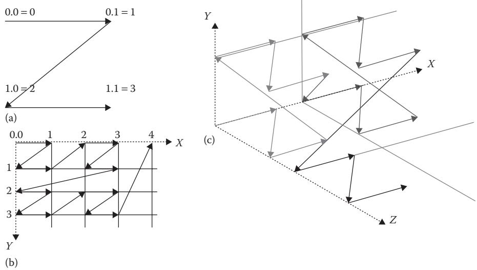
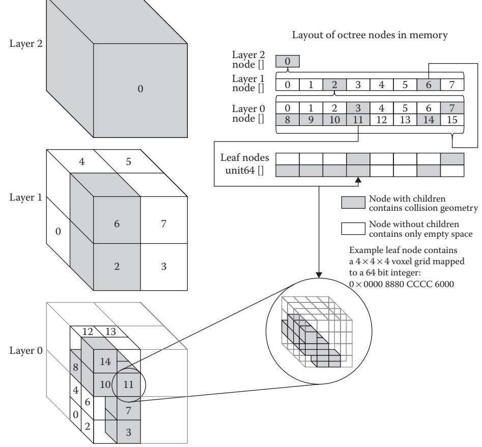
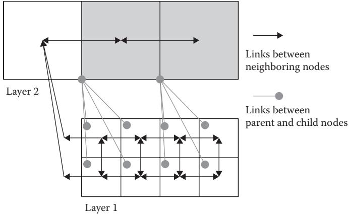
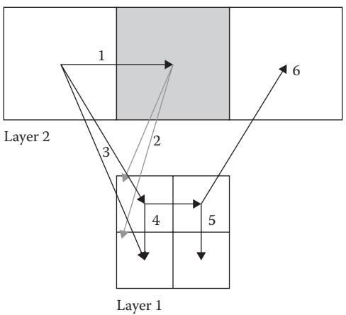
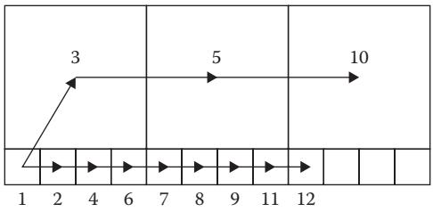

21

# 3D Flight Navigation Using Sparse Voxel Octrees

*Daniel Brewer*

- 21.1 Introduction
- 21.2 Alternative Techniques
- 21.3 Sparse Voxel Octrees
- 21.4 Creating the SVO
- 21.5 Pathfinding through a SVO
- 21.6 Complications and
	- Optimizations
- 21.7 Conclusion References
- 

# 21.1 Introduction

Navigating two-dimensional spaces is something we are quite familiar with in the game AI field. Regular grids, corridor maps, and navigation meshes (navmeshes) are all very well known and documented problem spaces. However, navigating in full three-dimensional environments where the agents are not constrained to the ground is quite a challenging problem space and is compounded when having to deal with very large, sparsely populated volumes that have clusters of dense, complex regions.

A Sparse Voxel Octree (SVO) is a spatial structure used in graphics rendering, particularly ray-tracing. This structure is optimized for handling large, sparsely populated regions. This chapter will cover how we adapted SVOs for use in 3D flight navigation in *Warframe*, discuss modifications to the A\* search algorithm to work on this adaptive grid representation and go into the details of tuning the heuristic to speed up the search by sacrificing optimality.

# 21.2 Alternative Techniques

Before covering how to use SVOs to represent flight navigation, we will briefly cover a few other alternatives.

A simple approach is to use a connected waypoint graph. Bounding volumes of free space can be manually placed by the level designer. Clear paths between volumes can be marked up as connections in the graph. These annotations work well in small areas or to simply provide occasional extra flight shortcuts above normal ground navigation. But, waypoint graphs in 3D have the same problems as in 2D space. There are a limited number of connections between volumes, which results in unnatural flight-paths as agents deviate to go back to a specific connection. Another limitation of this approach is that the graphs are typically made by hand and are therefore static and cannot easily adapt to changes in the level.

Alternatively, it is possible to extend navmeshes to be used for flight path planning. A series of navmeshes can be created at various heights above the ground. Special flightlinks can be used to connect these meshes to allow flying avatars to path up or down through the multiple layers of NavMesh. This technique can work well in confined spaces such as indoors or for creatures restricted to hovering near the ground. In very large volumes, such as a 2 km by 2 km by 2 km cube in an asteroid field, it becomes impossible to decide how many layers of NavMesh will be required to cover the volume adequately.

Regular grids are another option, though the sheer size of the search space is a major drawback. A 3D regular grid covering the aforementioned 2 km cube at 2 m resolution would require a billion grid locations!

Given the issues mentioned with each approach, an adaptive representation of the volume is required. More detail is needed in the dense, cluttered regions and wide the open regions should occupy as little memory as possible. Ideally, this representation can be constructed quickly and dynamically at runtime in order to handle dynamic levels where the collision geometry is not known ahead of time.

# 21.3 Sparse Voxel Octrees

SVOs are a popular graphics structure used for lighting and ray-tracing. Since they are essentially an octree, they facilitate fast position lookups, as you hierarchically split the volume into eight partitions at each level of the tree. The data structure contains neighbor connectivity information instead of just parent–child links to speed up traversal through the tree for ray-tracing. We can repurpose this connectivity information for path planning. There are several techniques for constructing SVOs, some of which boast interactive frame-rate performance by optimizing and parallelizing the construction algorithm (Schwarz and Seidel 2010). These optimizations are beyond the scope of this chapter, however you can refer to their paper for further information.

One big difference between a typical octree data structure and an SVO is the way the data are stored in memory. In an SVO, the data for each level of the tree are usually compacted together and stored in Morton Code order in memory. The Morton order is a z-shaped space-filling curve that maps three-dimensional coordinates into a one-dimensional sequence (Morton 1966, Haverkort and Freek van Walderveen 2008). It does this by interleaving the bits from each coordinate. For instance, the 2D *x*/*y* coordinate (0,3) is represented in binary as (00,11) and encoded as 1010. This method has the advantageous property of keeping neighbors within a quadtree or octree locally coherent. Figure 21.1 shows how Morton Codes fill 2D and 3D space. Storing the nodes in Morton order flattens the entire three-dimensional octree into a linear, one-dimensional array.

Diagrams showing 2D Morton Order (a, b). Note how the two-dimensional coordinates are mapped onto a single-dimensional sequence, shown by the line with arrows. 3D coordinates are mapped onto a single-dimensional sequence of Morton Codes in a similar fashion (c).

Figure 21.2 provides a high-level illustration of how the data in the SVO are arranged. Nodes from each level of the octree are stored in their own array, shown in the upper right of the figure, and the leaf nodes are stored in a separate array of 64-bit values. Following are the details of what is stored each node, and how the leaf nodes differ from other nodes in the SVO.

Each node in the tree requires a position so we know where it is in space. It also needs a link to its lower resolution parent node and a link to the first, higher resolution, child node. All nodes, except leaf nodes, will always have eight children. Since these children are stored contiguously in Morton Code order, we only need a link to the first child, and we can simply offset 0–7 to go to individual child nodes. Additionally, to help in traversal through the tree, each node contains six links to its neighbors through each of its faces.

Leaf nodes are handled differently. Since we are only concerned with collision or free space, our voxel data require only a single bit to store its state. The overhead of storing links with each voxel would be too costly. We can however use a small, compact 4 × 4 × 4 voxel grid for each leaf; this fits nicely into 64 bits.

When dealing with massive environments, every bit of memory is important. Using pointers for links will mean that the data size will vary drastically between 32 bit and 64 bit operating systems. In order to control memory usage, offsets into arrays are used for the links instead of pointers. Links are a general purpose way of referencing both an arbitrary node in the octree and an arbitrary voxel. They are used both within the octree and in the A\* search. So, links need to be able to go up and down layers of the octree, not only between neighbors on the same layer. Additionally, the voxels in our leaf nodes are really

Simple illustration of the arrangement of the nodes in a Sparse Voxel Octree. Each occupied node in a layer has eight children in the layer below it. The bottom-most layer maps directly onto the leaf node array. The leaf nodes, however, are not Octree nodes but simply a 64-bit integer representing a 4 × 4 × 4 voxel grid.

compound nodes representing 64 different locations, which we call subnodes. We pack our links into 32 bit integers as follows:

4 bits—layer index 0 to 15 22 bits—node index 0 to 4,194,303 6 bit—subnode index 0 to 63 (only used for indexing voxels inside leaf nodes)

## 21.4 Creating the SVO

We based our construction of the SVO on the article mentioned in the previous section (Schwarz and Seidel 2010). The tree is constructed from the bottom up, one layer at a time. This is different from the typical octree construction that splits parent nodes from the top down until arriving at the desired resolution of the child node. Doing it one layer at a time keeps each layer coherent in memory and also allows for parallelization to speed up the construction.

The first step is to determine how many leaf nodes are required. To do this, rasterize the collision geometry at a low resolution. If the final resolution is 2 m per voxel, then the leaf nodes in the SVO will be 4 × 2 = 8 m cubes. The parent of a leaf node will always have to be split; this means having two leaf nodes next to each other in each direction. The low-resolution rasterization can therefore be performed at a 16 m resolution, which is effectively layer 1 in the octree, where the leaves are in layer 0. Instead of rasterizing into a voxel grid, we simply keep a sorted list of unique Morton Codes of the solid voxels.

Once complete, the number of leaf nodes required can be calculated by counting the number of unique Morton Codes from the low resolution (layer 1) rasterize step. Eight leaf nodes (at layer 0) are required for each Morton Code. Their 3D coordinates can be calculated from the Morton Codes, and the memory for the nodes can be allocated and initialized in a single contiguous block.

The octree structure can now be built up from the lowest to the highest level. Bitwise operations can be used to modify nodes at the current level to get the Morton Code for the parent level. The parent–child links between layers are filled in on the way up; afterward the neighbor links are filled in while traversing back down.

If a node has no neighbor at the same level, then the neighbor link is set to that node's higher level parent's neighbor. This ensures that each node always has a link to a neighbor through each of its faces. Figure 21.3 illustrates how the neighbor links are set up.

Finally, rasterization is performed at the desired resolution into the leaf nodes. Note that unlike a traditional octree, the term leaf node only refers to the occupied, highest resolution nodes in the octree, that is, layer 0 nodes. The SVO only requires leaf nodes where collision geometry exists. A higher layer node that does not contain any collision geometry will not have any child nodes. These nodes are referred to as childless nodes

#### Figure 21.3

Neighbor links in the Sparse Voxel Octree connect to neighbors of the same layer, and if there is no neighbor in the same layer, the neighbor links point to the parent's neighbor.

instead of leaf nodes in traditional octrees. Taking the example SVO in Figure 21.2, node 0 in layer 1 is a childless node and contains only empty space and can be freely traversed. Node 6 in layer 1 however, does have children: layer 0, nodes 8–15. Most leaf nodes, such as node 11 in layer 0, will be partially blocked and have some solid and some empty voxels.

Some leaf nodes will be completely free of collision geometry, such as node 0 in layer 0. The data payload for a leaf is only a 64-bit integer, and an empty leaf will contain the value 0. These nodes can be considered padding for memory alignment. The speed advantage of not culling them outweighs the small additional memory cost. As explained below, during pathfinding, any leaf node with a value of 0 can be skipped over, as it is open space, and any node with a value of −1, or 0×FFFFFFFFFFFFFFFF, will be fully blocked and need not be explored.

## 21.5 Pathfinding through a SVO

The SVO is now a connected graph representing the free space that agents can traverse. A graph search algorithm can be used to find paths through this space. We initially chose to implement the standard A\* search.

The first step is to look up the locations of the start and end points for the desired path and push the start node onto the open list. Next, pop the best node off the open list and mark it as visited. Expand this node by getting the neighboring nodes, scoring them with the A\* f-cost, distance traveled plus the estimate of the distance to goal, and then push them onto the open list. This continues until the end point is reached.

Looking up positions is the same in an SVO as in a standard octree. Start at the top of the tree and test whether the point is inside the axis-aligned box of each child. Once the child containing the point has been identified, we repeat the test one layer deeper down the octree. Since octrees subdivide the volume by eight at each layer of the tree, this procedure is very fast. If we arrive at a childless node, then the point is inside a large volume of empty space. If we arrive at a leaf node, then we can calculate which voxel within the leaf contains the point. We refer to this as the subnode index, and it ranges from 0 to 63 as it indexes a specific bit in the 64-bit voxel grid. In either case, a link can be used to represent this location.

To explore nodes in the SVO graph, we simply consult the neighbor links. Referring back to Figure 21.2, layer 1 node 4 has neighbor links to layer 1 node 0, layer 1 node 5, and layer 1 node 6. It is not a problem if a node has a link to a higher level node (e.g., layer 1 linking to layer 2), as this means the search is moving into a larger open space. The search can freely jump between layers of the SVO as necessary.

A minor complication comes when moving from a low-resolution level to a neighbor that has higher resolution children, such as going from layer 1 node 4 to layer 1 node 6 in Figure 21.2. This is solved by pushing the low-resolution node (i.e., layer 1 node 6) to the open list when first encountered. When this node is popped off, instead of processing it as normal, we find the higher resolution children that are neighbors of the previous node and score and push those onto the open list. In our Figure 21.2 example, these new nodes would be layer 0 nodes 8, 9, 12, and 13. The search loop then proceeds as normal. Figure 21.4 shows a 2D example of the order of exploration of nodes jumping from higher level layers through lower level nodes and back up to higher level nodes again.

Node expansion during A\* search. To expand a node that has higher resolution children, add the children neighboring the previous node to the open list and expand each of them in turn through the usual search loop.

Another complication to the search arises when we reach a leaf node. The voxel grid representing each leaf is a 64-bit integer. If this value is 0, it means the leaf node is a empty space, and it is treated like any other node in the tree. If the value is 0×FFFFFFFFFFFFFFFF, or −1, it means the leaf is entirely solid and will block all movement. This node is then marked closed, and the search will continue through the rest of the open nodes. Any other value means the leaf node contains some open space and some solid collision.

Each voxel can be treated as a separate node in the search graph. However, there are no explicit links in these tiny 4 × 4 × 4 voxel grids. Neighbors are calculated implicitly between voxels based on the 3D coordinates within the voxel grid. To avoid confusion between voxels and octree nodes, voxels inside leaf nodes are referred to by the subnode index, which is simply the 6-bit index into the 64-bit integer representing the voxel in the 4 × 4 × 4 grid. Once we reach edge of the tiny voxel grid, the search continues to the neighbor of the leaf node containing the grid.

## 21.6 Complications and Optimizations

It is easy to forget how big the 3D search space can get. Adding visualizations and statistics to the search will show how much space A\* is actually searching. The results can be significantly larger than anticipated (Brewer 2015). The adaptive grid nature of the octree certainly helps the search jump over large tracts of open space. However, the plain A\* search is designed to find the optimal path and will often get bogged down exploring all the tiny nodes in the densely populated regions instead of circling around them through larger nodes. Figure 21.5 shows a simple form of this "leap-ahead-andback-fill" problem.

It is possible to tweak the distances by using center of faces of the cubes instead of node centers and to use Manhattan distance instead of Euclidian distance. This tends to

Vanilla A\* search does not take advantage of exploring larger nodes and instead goes back to explore all the small nodes on a more direct route to the goal.

only help in simple cases and does not provide as much benefit in more complex maps. It is important to experiment on your own maps to see which is better for your specific situation.

Another optimization is to bias the A\* toward a greedier search by weighting the score more toward the estimation than the distance traveled. This is not an uncommon A\* optimization in games (Rabin and Sturtevant 2013) and adjusts the search to prefer exploring nodes it thinks are closer to the goal. This greedy approach does help significantly, however the search can still push through lots of tiny nodes instead of taking advantage of the larger, open ones.

The heuristic can further be adjusted with a node size compensation factor. In this approach, both the cost and estimation values are adjusted depending on the size of the node. Different compensation amounts are used for each component. The goal is to make it cheaper to go through large nodes and more expensive to go through small ones. This helps dramatically, but one final adjustment is to use a unit cost for distance traveled instead of Euclidian distance. This means that no matter how big the node is, traveling through it has the same cost. This effectively biases the search even more toward exploring through large nodes.

Using a greedy search and node size compensation are always at least an order of magnitude better than straight A\* and using unit node costs helps the search use the larger nodes and more often than not, gets an extra order of magnitude speed boost. The resulting path is not an optimal path. Agents will prefer to stay to open-space regions and will tend to avoid dense clusters of collision geometry, unless it is necessary to navigate into them.

The next problem that still hurts the optimized heuristic is an expected A\* issue that gets exacerbated in 3D. This is the wave-front exploration pattern as A\* tries to search around an obstacle. In 2D, when A\* hits a line obstacle, it spreads out to either side in order to try find a way around. In 3D when the search hits an obstacle, it has to explore up and down as well as left and right. This can result in an expanding cone of explored nodes, spreading out behind the surface until a way around is found.

JPS (Harabor and Grastien 2011) is one approach to overcome the A\* wave-front expansion shortfall. It should be possible to extend our 3D search in the same way. We attempted this approach and found a great reduction in the number of nodes expanded during the search, however the time taken for the search was actually an order of magnitude slower than the tweaked heuristic A\* . Our initial implementation of 3D JPS was admittedly quite naive and unoptimized, however JPS still visits a lot of nodes in 2D while finding the jump points, and in 3D, this becomes an O(n3 ) flood fill instead of O(n2 ). This optimization was not pursued further, though a form of jump point expansion may prove to be a useful optimization. Caution must be taken to ensure that it does in fact improve performance instead of hindering it. See (Sturtevant and Rabin 2016) for more discussion of these issues.

Another obvious optimization would be to use a hierarchical search. Since we already have a hierarchical graph structure, this does seem like an obvious choice. This approach would find a path at the lowest resolution and then refine the higher detail levels until a suitably detailed path has been found. However, doing this would require the search to know whether it can traverse from each face to every other face of each node at every level of the tree. Care needs to be taken, so this extra information does not end up bloating memory usage substantially. This is still an option worthy of future exploration, as it may substantially help the search performance.

# 21.7 Conclusion

As video game environments become more complex and detailed, players are becoming more demanding of new gameplay experiences. Using octrees for 3D navigation is not a particularly novel idea, however if you have never faced this problem, it can be a daunting problem space with many unforeseen traps. The advice provided in this chapter should provide you with a good starting direction.

If you do not take anything else away from this chapter, be sure to add visualizations and statistical reports to your algorithms to fully understand how they are functioning and ensure they are functioning as intended.

## References

- Brewer, D. 2015. Getting off the NavMesh: Navigating in Fully 3D Environments. GDC 2015. San Francisco, CA: AAAI Press. Slides http://www.gdcvault.com/ play/1022017/Getting-off-the-NavMesh-Navigating, Video http://www.gdcvault. com/play/1022016/Getting-off-the-NavMesh-Navigating.
- Harabor, D., and Grastien, A. 2011. Online graph pruning for pathfinding on grid maps. In *Proceedings of the 25th National Conference on Artificial Intelligence* (*AAAI*). San Francisco, CA. https://users.cecs.anu.edu.au/~dharabor/data/papers/harabor-grastienaaai11.pdf.
- Haverkort, H., and van Walderveen, F. 2008. Space-filling curves for spatial data structures. TU Eindhoven. http://http://www.win.tue.nl/~hermanh/stack/dagstuhl08 talk.pdf.
- Morton, G. M. 1966. *A Computer Oriented Geodetic Data Base and a New Technique in File Sequencing. Technical Report*. Ottawa, Canada: IBM Ltd.
- Rabin, S., and Sturtevant, N. R. 2013. Pathfinding architecture optimizations. In *Game AI Pro*, ed. S. Rabin. Boca Raton, FL: CRC Press, pp. 241–252. http://www.gameaipro.com/ GameAIPro/GameAIPro\_Chapter17\_Pathfinding\_Architecture\_Optimizations.pdf.
- Schwarz, M., and Seidel, H. P. 2010. Fast Parallel Surface and Solid Voxelization on GPUs. *ACM Transactions on Graphics, 29, 6 (Proceedings of SIGGRAPH Asia 2010), Article 179*. New York, NY: ACM. http://research.michael-schwarz.com/publ/files/ vox-siga10.pdf.
- Sturtevant, N. R., and Rabin, S. 2016. Canonical orderings on grids. In *International Joint Conference on Artificial Intelligence*. New York: IJCAI, pp. 683–689. http://web.cs.du. edu/~sturtevant/papers/SturtevantRabin16.pdf.
